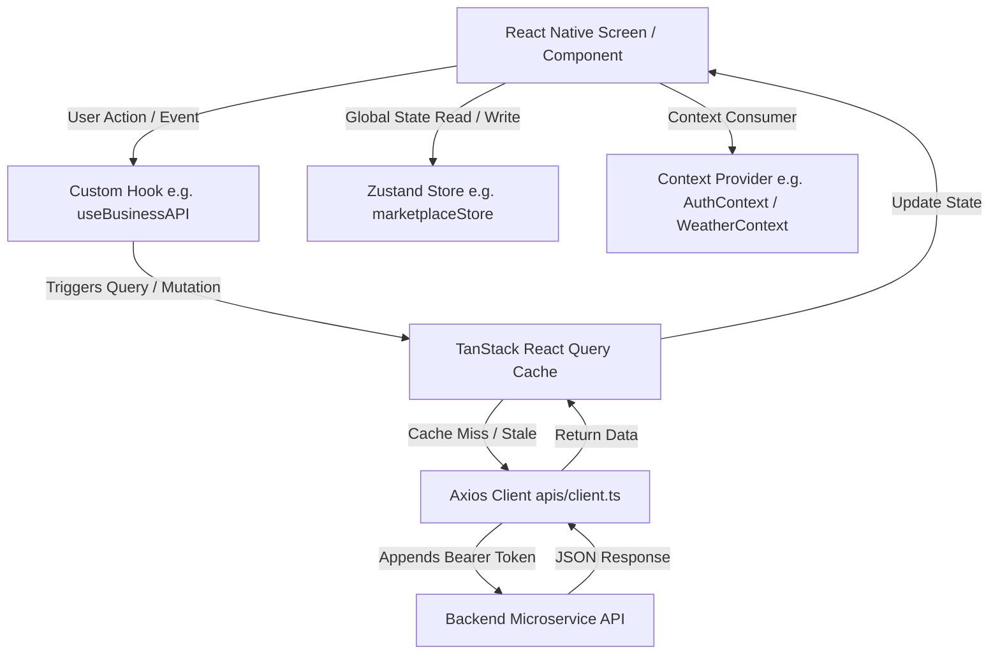

# Rehbar Mobile App (`rehbar_mobile_app`) — Architecture & Context Document

> **Purpose**: This document serves as the authoritative context map for the Rehbar Mobile Application. It provides a complete structural, technical, and feature-level overview designed to quickly context-window prime AI models, developers, and automated tools.

---

## 1. Executive Summary & Tech Stack

**Rehbar Mobile App** is a feature-rich, multi-domain mobile application built on **React Native** and **Expo (v54)** using **Expo Router (v6)** file-based navigation. The application integrates daily lifestyle utilities (Weather, Location), Islamic services (Quran Audio & Text, Prayer Times, Hadith), local business directories, marketplaces, real-time messaging, and comprehensive monetization (AdMob).

### Primary Technology Stack

| Domain | Technology / Library | Purpose |
| :--- | :--- | :--- |
| **Core Framework** | React Native `0.81.5`, React `19.1.0`, Expo `~54.0.35` | Cross-platform app runtime |
| **Routing / Navigation** | `expo-router` `~6.0.24`, `@react-navigation/*` | File-based routing, Drawer & Tab navigation |
| **State Management** | `zustand` `^5.0.11`, React Context | Local & global app state management |
| **Server State & Caching** | `@tanstack/react-query` `^5.90.21`, `@tanstack/query-async-storage-persister` | API request caching, auto-refetching, and offline persistence |
| **Local Storage** | `react-native-mmkv` `^4.3.1`, `expo-secure-store` `~15.0.8` | High-performance key-value storage & secure token storage |
| **Maps & Location** | `@maplibre/maplibre-react-native` `^10.0.0`, `expo-location` | Interactive maps, geolocation, and reverse geocoding |
| **Authentication** | `@react-native-google-signin/google-signin`, `@react-native-firebase/auth` | Social & token-based user authentication |
| **Notifications & Realtime** | `@react-native-firebase/messaging`, `expo-notifications`, `socket.io-client` | Push notifications, FCM topic messaging, and WebSockets |
| **Analytics & Crash Reporting** | `@sentry/react-native` `^8.13.0`, `@react-native-firebase/analytics`, `crashlytics` | Real-time crash monitoring and user telemetry |
| **Monetization & Ads** | `react-native-google-mobile-ads` `16.3.3` | App Open, Interstitial, Rewarded, and Banner Ads |
| **Audio & Media** | `expo-av` `^16.0.8` | Quran audio recitations streaming and playback control |

---

## 2. Comprehensive Directory Structure

```
d:/mc/mobile_app/
├── app/                        # Expo Router file-based screens & navigation routes
│   ├── (auth)/                 # Authentication screens (Login, Signup, Forgot Password)
│   ├── (drawer)/               # Main app container with drawer navigation
│   │   ├── (tabs)/             # Bottom tab bar navigator screens
│   │   │   ├── index.tsx       # Home Screen
│   │   │   ├── business.tsx    # Business Directory Screen
│   │   │   └── marketplace.tsx # Marketplace Screen
│   │   ├── business-registration.tsx # Business Onboarding Flow
│   │   ├── feedback.tsx        # User Feedback Submission
│   │   └── place-submission.tsx# New Place / Landmark Submission
│   ├── business/               # Business detail & category screens
│   ├── listing/                # Search & filtered directory listing screens
│   ├── marketplace/            # Marketplace item detail & category screens
│   ├── place/                  # Individual place detail screens
│   ├── quran/                  # Quran Surah list, reader & audio player screens
│   ├── support/                # Customer support & help desk
│   ├── user/                   # User profile, history & management
│   ├── weather/                # Weather detail & saved cities screens
│   ├── _layout.tsx             # Root app provider wrapper & router entry
│   ├── index.tsx               # App entry redirect logic
│   ├── onboarding.tsx          # First-time user onboarding screens
│   ├── prayerTimes.tsx         # Detailed Prayer Times & Qibla screen
│   ├── settings.tsx            # App settings (Theme, Notifications, Preferences)
│   └── weather.tsx             # Main Weather screen
├── ads/                        # AdMob monetization services, hooks & components
│   ├── adManager.service.ts    # Ad orchestration & limits controller
│   ├── admob.service.ts        # AdMob initialization & configuration
│   ├── appOpen.service.ts      # App Open ad lifecycle handler
│   ├── interstitial.service.ts # Interstitial ad manager
│   ├── rewarded.service.ts     # Rewarded ad manager
│   ├── components/             # Banner & native ad renderers
│   └── hooks/                  # `useAdInterstitial`, `useAdRewarded` hooks
├── analytics/                  # User activity & screen tracking
│   ├── analyticsEvents.ts      # Standardized event definition schemas
│   ├── analyticsService.ts     # Firebase Analytics wrapper
│   └── screenTracker.ts        # Navigation listener for automatic screen tracking
├── apis/                       # Axios network services & endpoint modules
│   ├── client.ts               # Base Axios instance with auth headers & refresh interceptors
│   ├── ai.ts                   # AI assistance / chat endpoints
│   ├── business/               # Business directory endpoints
│   ├── marketplace/            # Marketplace endpoints
│   ├── notifications/          # Notification preference endpoints
│   ├── prayerTimes.ts          # External / internal prayer calculation APIs
│   ├── quran.ts                # Quran text & audio stream metadata APIs
│   └── weather/                # OpenWeather / internal weather endpoints
├── components/                 # Reusable UI component library (organized by feature domain)
│   ├── auth/                   # Login/Signup forms & social buttons
│   ├── business/               # Business cards, filters, rating badges
│   ├── common/                 # Header, Loading, Empty state, Custom buttons
│   ├── home/                   # Quick widgets, banners, featured listings
│   ├── marketplace/            # Product cards, search bars, category sliders
│   ├── prayers/                # Next prayer card, Qibla compass, countdown
│   ├── quran/                  # Surah card, audio control bar, ayah reader
│   └── ui/                     # Primitives (ThemedText, ThemedView, Input, Modal)
├── configs/                    # Static configuration files & secrets
├── constants/                  # Application constants (Colors, Search config, Categories)
├── context/                    # React Context Providers for global runtime states
│   ├── AuthContext.tsx         # User session, JWT tokens & auth status
│   ├── SocketContext.tsx       # Socket.io connection state & event listeners
│   ├── ThemeContext.tsx        # Light/Dark mode & theme tokens
│   └── WeatherContext.tsx      # Current location weather data & refresh trigger
├── hooks/                      # Custom React hooks (Data fetching & UI helpers)
│   ├── useBusinessAPI.ts       # React Query hooks for Business Directory
│   ├── useMarketplaceAPI.ts    # React Query hooks for Marketplace products
│   ├── useNextPrayer.ts        # Dynamic countdown calculation to next prayer
│   ├── usePrayerTimes.ts       # Location-aware prayer times hook
│   ├── useSurahPlayer.ts       # `expo-av` audio playback control for Quran
│   ├── useWeather.ts           # Weather data fetching hook
│   └── useLocationSync.ts      # Device geolocation watcher & background sync
├── lib/                        # Infrastructure libraries (Sentry, QueryClient, Storage)
│   ├── query-client.ts         # TanStack Query client config with persistence
│   ├── remoteConfig.ts         # Firebase Remote Config wrapper
│   ├── sentry.ts               # Sentry error reporting initialization
│   └── tokenCache.ts           # Expo SecureStore token storage helper
├── store/                      # Zustand state stores
│   ├── ads.store.ts            # Ad frequency caps & placement state
│   ├── dataUsageStore.ts       # Network data usage metrics
│   ├── hadithStore.ts          # Daily Hadith cache
│   ├── marketplaceStore.ts     # Marketplace search & filter state
│   └── notificationStore.ts    # Unread notifications count & payload storage
├── types/                      # TypeScript interfaces & types
└── utils/                      # Helper utilities (Date formatters, Validators, Haptics)
```

---

## 3. Core Feature Modules & Implementation Detail

### 3.1. Authentication & Session Management
- **Providers**: `context/AuthContext.tsx` wraps the app in `app/_layout.tsx`.
- **Token Storage**: JWT Access & Refresh tokens are persisted securely via `expo-secure-store` using `lib/tokenCache.ts`.
- **Google Sign-In**: Powered by `@react-native-google-signin/google-signin` and Firebase Auth (`@react-native-firebase/auth`).
- **Axios Interceptors**: `apis/client.ts` automatically attaches `Authorization: Bearer <token>` to requests and handles dynamic 401 token refresh.

### 3.2. Islamic Utilities (Quran, Prayer Times, Hadith)
- **Quran Recitation & Text**:
  - `hooks/useSurahPlayer.ts` manages audio playback via `expo-av`. Supports play, pause, seek, and background audio streaming.
  - `apis/quran.ts` provides surah list metadata and audio reciter streams.
  - UI components in `components/quran/` handle text visualization and audio bar synchronization.
- **Prayer Times & Next Prayer Countdown**:
  - `hooks/usePrayerTimes.ts` and `hooks/useNextPrayer.ts` compute accurate daily prayer schedules based on the user's GPS coordinates (`expo-location`).
  - Screen `app/prayerTimes.tsx` provides full prayer timelines and Qibla direction indicators.
- **Daily Hadith**:
  - `store/hadithStore.ts` caches daily Hadith data locally to avoid excessive API hits.

### 3.3. Weather Services & Location Sync
- **Location Sync**: `hooks/useLocationSync.ts` monitors device GPS status and updates current coordinates.
- **Weather Context**: `context/WeatherContext.tsx` provides global weather state across screens.
- **Saved Cities**: `hooks/useSavedCities.ts` allows users to bookmark and monitor weather for multiple custom locations.

### 3.4. Local Business Directory & Place Submissions
- **Browse & Search**: `app/(drawer)/(tabs)/business.tsx` and `app/listing/` render searchable, categorized local business profiles.
- **Business Registration**: `app/(drawer)/business-registration.tsx` provides a multi-step form for business owners to list their business.
- **Place Submissions**: `app/(drawer)/place-submission.tsx` enables crowdsourced landmark and location submissions.
- **API Integration**: `hooks/useBusinessAPI.ts` handles listing creation, search queries, ratings, and reviews using TanStack Query.

### 3.5. Marketplace
- **Products & Catalog**: `app/(drawer)/(tabs)/marketplace.tsx` and `app/marketplace/` display peer-to-peer and vendor product listings.
- **Filtering & State**: `store/marketplaceStore.ts` stores active search filters, category selections, and sorting options.
- **Inquiries**: Users can send direct inquiries to item owners via `apis/inquiries.ts`.

### 3.6. Real-Time Messaging & Notifications
- **Push Notifications**: Integrated via Firebase Cloud Messaging (`@react-native-firebase/messaging`) and `expo-notifications`.
- **Topics**: Users can subscribe to specific notification topics (`constants/notificationTopics.ts`).
- **WebSockets**: `context/SocketContext.tsx` maintains a real-time `socket.io-client` connection for live in-app notifications and updates.
- **Store**: `store/notificationStore.ts` tracks unread counts and incoming notification payloads.

### 3.7. Monetization & Ad Network (AdMob)
- **Ad Engine**: `ads/adManager.service.ts` controls ad loading, cooldown timers, and impression caps.
- **Ad Types Supported**:
  - **App Open**: `ads/appOpen.service.ts` triggers when the app returns from background.
  - **Interstitial**: `ads/interstitial.service.ts` triggered during transition checkpoints (e.g. after submitting a form).
  - **Rewarded**: `ads/rewarded.service.ts` unlocks premium features/content upon ad completion.
  - **Banner Ads**: `ads/components/` provides reusable banner ad slots.

### 3.8. Analytics & Observability
- **Crash Reporting**: Sentry (`lib/sentry.ts`) captures JS & native exceptions with full stack traces. Firebase Crashlytics provides native-level crash monitoring.
- **User Telemetry**: `analytics/analyticsService.ts` logs custom engagement events to Firebase Analytics.
- **Screen Tracking**: `analytics/screenTracker.ts` automatically captures screen view events on Expo Router navigation state changes.

---

## 4. Architectural Patterns & Data Flow



1. **UI Components** (`app/`, `components/`) trigger custom React hooks (`hooks/`).
2. **Data Layer** uses **TanStack Query** (`@tanstack/react-query`) for fetching, caching, revalidating, and persisting API responses.
3. **HTTP Client** (`apis/client.ts`) centralizes request configuration, header injection (token, location, device metrics), error logging, and token refresh.
4. **Client State** uses **Zustand** (`store/`) for synchronous lightweight state and **React Context** (`context/`) for runtime providers (Auth, Weather, Sockets, Theme).

---

## 5. Guidelines for AI Assistants & Developers

When modifying or extending this repository:

1. **Routing**: Use Expo Router conventions (`expo-router`). Add new screens inside `app/` using TSX files. Never use legacy React Navigation container setup manually.
2. **API & Data Fetching**: Do not call `axios` directly inside components. Create or extend API endpoints in `apis/` and expose them via a TanStack Query hook in `hooks/`.
3. **State Management**:
   - Use **TanStack Query** for server state.
   - Use **Zustand** (`store/`) for persistent app settings or UI flags.
   - Use **React Context** (`context/`) ONLY for top-level runtime providers.
4. **Styling & Theming**: Use `components/ui/ThemedText.tsx` and `components/ui/ThemedView.tsx` to support light/dark modes automatically. Ensure strict adherence to a flat, borderless design language globally—do NOT use `borderWidth`, `borderTopWidth`, `borderBottomWidth`, etc. All new cards, inputs, buttons, and tabs must rely on background colors, shadows, and spacing for visual hierarchy instead of borders. Ensure all icons and navigation links are properly synced with Dark Mode using `colors.text` or `colors.icon`.
5. **Storage**: Prefer `react-native-mmkv` for fast key-value storage. Use `expo-secure-store` only for sensitive authentication tokens.
