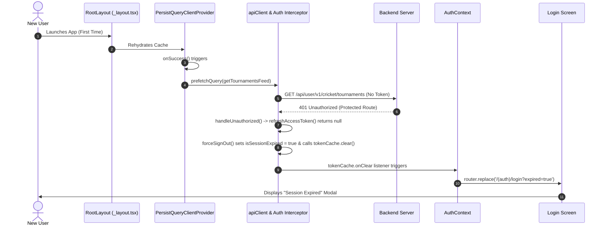

# Fix Plan: Session Expired Modal on New Install & Premature Cricket API Calls

> **Status:** Planning document — describes the intended fix, not yet implemented.
> Both root causes below were verified directly against the code on `v_3.0.1` (identical to `v_3.0.0` at the time of writing) before this plan was written up: the cricket prefetch, the backend route guard, the interceptor's unconditional sign-out, and the `AuthContext` redirect were all confirmed present exactly as described.

## 1. Overview of Issues

1. **Issue A (Premature Cricket API Calls):** When the app is opened, on splash/auth screens or by an unauthenticated new user, cricket APIs (`/api/user/v1/cricket/tournaments`) are called automatically.
2. **Issue B (Session Expired Modal on Fresh Install):** When a new user installs and launches the app, they are greeted with a "Session Expired" modal on the login screen despite never having logged in before.

---

## 2. Root Cause Analysis



### Problem 1: Premature Cricket Feed Prefetching

- **Location:** `app/_layout.tsx`
- **Cause:** `<PersistQueryClientProvider>` includes an `onSuccess` callback that immediately fires `queryClient.prefetchQuery` for `CRICKET_QUERY_KEYS.feed({ page: 1, limit: 20 })`.
- **Impact:** This fires unconditionally on app startup (even when unauthenticated, on splash, onboarding, or auth screens). Because `/api/user/v1/cricket/tournaments` is protected by `validateUserSession` in `backend/src/routes/api/user.js` (`router.use(validateUserSession)` is applied ahead of every route on that router, including the cricket routes), it always fails with `401 Unauthorized` for non-logged-in users.

### Problem 2: Unguarded 401 Handling and Expiry Cascade

- **Location:** `apis/interceptors/auth.ts` & `context/AuthContext.tsx`
- **Cause:**
  1. `handleUnauthorized()` intercepts every `401` status code indiscriminately (aside from `login`/`refresh-token` URLs).
  2. When an unauthenticated request (without an `Authorization` header or refresh token) receives a `401`, `refreshAccessToken()` returns `null` because there is nothing in `tokenCache` or `secureStorage` to refresh.
  3. The interceptor then unconditionally calls `forceSignOut()`, which marks `tokenCache.setSessionExpired(true)`.
  4. `AuthContext` listens to `tokenCache.onClear()`, sees `isSessionExpired() === true` — with no check for whether a `user` was ever set — and navigates to `/(auth)/login?expired=true`.
  5. `login.tsx` reads `expired === 'true'` from search parameters and displays the "Session Expired" modal.

---

## 3. Step-by-Step Implementation Plan

### Step 1: Remove Premature Cricket Prefetch from Root Layout

**File:** `app/_layout.tsx`

- **Change:** Remove the `getTournamentsFeed` prefetch from `PersistQueryClientProvider.onSuccess`.
- **Code Change:**

```tsx
// BEFORE:
<PersistQueryClientProvider
  client={queryClient}
  persistOptions={{ persister: asyncStoragePersister }}
  onSuccess={() => {
    queryClient.prefetchQuery(homePageConfigQueryOptions()).catch(() => { });
    queryClient.prefetchQuery({
      queryKey: CRICKET_QUERY_KEYS.feed({ page: 1, limit: 20 }),
      queryFn: () => getTournamentsFeed({ page: 1, limit: 20 }),
      staleTime: 1000 * 60 * 15,
    }).catch(() => { });
  }}
>

// AFTER:
<PersistQueryClientProvider
  client={queryClient}
  persistOptions={{ persister: asyncStoragePersister }}
  onSuccess={() => {
    queryClient.prefetchQuery(homePageConfigQueryOptions()).catch(() => { });
  }}
>
```

- **Rationale:** Cricket tournaments and matches are already queried on-demand inside `app/cricket/index.tsx` via `useCricketAPI()` when an authenticated user opens the Cricket Hub.

### Step 2: Guard 401 Interceptor Against Unauthenticated Requests

**File:** `apis/interceptors/auth.ts`

- **Change:**
  1. In `handleUnauthorized()`, check whether the request originally contained an `Authorization` header (`config.headers?.Authorization`) or whether an active session/token actually exists in `tokenCache` or storage.
  2. If the request was made without an `Authorization` header (unauthenticated request), do not attempt refresh, do not trigger `forceSignOut()`, and do not mark the session as expired.
- **Code Change:**

```ts
export async function handleUnauthorized(error: any, apiClient: any): Promise<any | null> {
    const config = error.config as any;
    const status = error.response?.status;

    if (status !== 401 || !config) return null;

    const url: string = config.url || '';
    if (url.includes('login') || url.includes('refresh-token')) return null;

    // If the request had no Authorization header and there is no active token in cache/storage,
    // this is an unauthenticated request rather than an expired session.
    const hasAuthHeader = !!config.headers?.Authorization;
    const hasCachedToken = !!tokenCache.get() || !!tokenCache.getRefresh();
    if (!hasAuthHeader && !hasCachedToken) {
        return null;
    }

    if (config._retriedAfterRefresh) {
        forceSignOut();
        return null;
    }

    const newToken = await refreshAccessToken();
    if (!newToken) {
        forceSignOut();
        return null;
    }

    config._retriedAfterRefresh = true;
    config.headers = { ...(config.headers || {}), Authorization: `Bearer ${newToken}` };
    return apiClient(config);
}
```

### Step 3: Guard `AuthContext` onClear Redirection

**File:** `context/AuthContext.tsx`

- **Change:** Inside `tokenCache.onClear()`, check if a user session was previously active (`user !== null`) before navigating to `/(auth)/login?expired=true`. This is a defense-in-depth measure — Step 2 should already prevent `forceSignOut()` from firing for a request that was never authenticated, but this closes the gap for any other path that might clear the cache with `isSessionExpired` set.
- **Code Change:**

```ts
useEffect(() => {
    const unsubscribe = tokenCache.onClear(() => {
        if (tokenCache.isSessionExpired() && user !== null) {
            setUser(null);
            router.replace('/(auth)/login?expired=true');
            tokenCache.setSessionExpired(false);
        } else {
            setUser(null);
            tokenCache.setSessionExpired(false);
        }
    });
    return () => unsubscribe();
}, [router, user]);
```

---

## 4. Verification & Testing Checklist

- **Clean App Launch (New Install / Cleared Storage):**
  - Verify no network requests are sent to `/api/user/v1/cricket/*` on startup or on auth screens.
  - Verify onboarding/login screen displays normally without the "Session Expired" modal.
- **Public Route Navigation:**
  - Verify public routes (Weather, Terms, Privacy, Onboarding) operate without triggering 401 redirects.
- **Legitimate Session Expiry:**
  - Log in with valid credentials.
  - Invalidate the access & refresh token on backend (or simulate token expiry).
  - Perform an authenticated action and verify the user is properly redirected to `/(auth)/login?expired=true` and sees the modal.
- **Cricket Hub Access (Authenticated):**
  - Navigate to Cricket Hub as an authenticated user and ensure tournament feeds load correctly.
